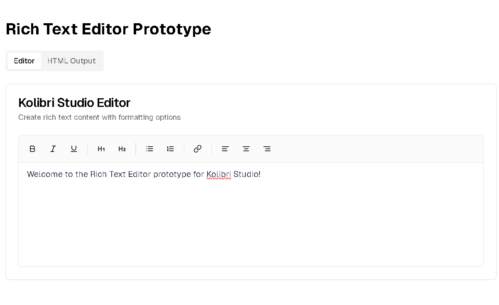
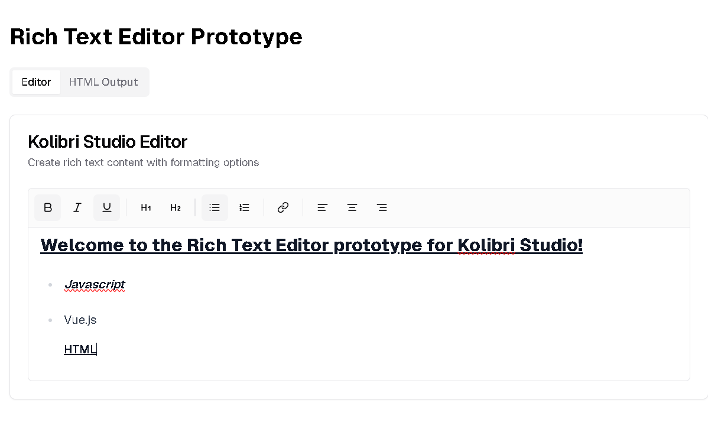
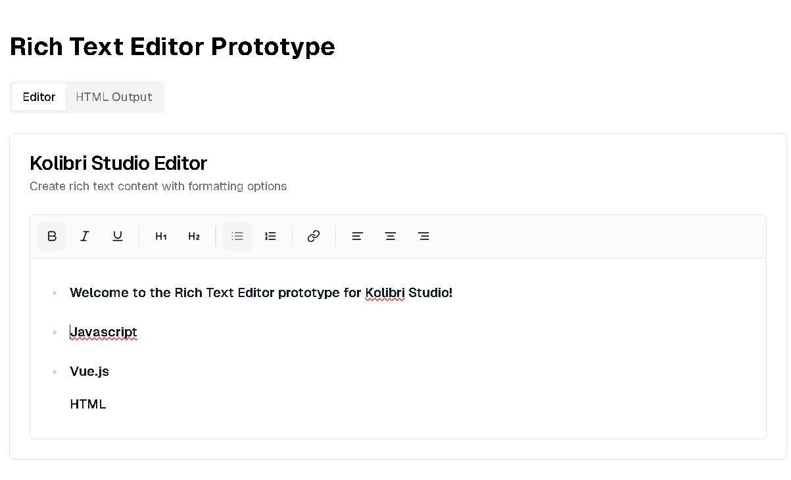
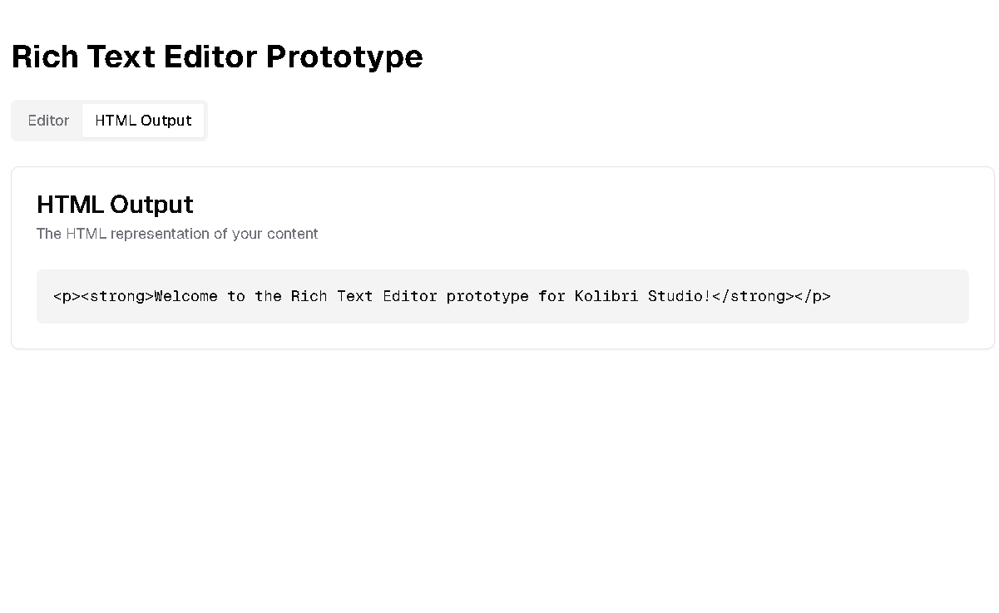

# Rich Text Editor

A **fully responsive** and **feature-rich** Rich Text Editor built using modern web technologies.** This editor provides users with the ability to format text, add images, and apply various styling options, making it ideal for blogging, note-taking, and web content management.

## 🌟 Features

✔ **Bold, Italic, and Underline formatting**  
✔ **Headings and Paragraph Styling**  
✔ **Ordered and Unordered Lists**  
✔ **Link Insertion**  
✔ **HTML Input/Output Support**  
✔ **Customizable Toolbar**  
✔ **Fully Responsive for Desktop, Tablet, and Mobile**  
✔ **Keyboard Shortcuts for Quick Editing**  

---

## 📸 Screenshots

### **Editor in Action**


### **Basic Formatting (Bold, Italic, Underline)**


### **Lists (Ordered and Unordered)**


### **Headings Support**


### **Link Insertion**


### **HTML Input/Output Support**


### **Customizable Toolbar**


---

## 🛠 Installation & Setup

To run this project locally, follow these steps:

### **1. Clone the Repository**
```sh
git clone https://github.com/YOUR_GITHUB_USERNAME/rich-text-editor.git
cd rich-text-editor
```

### **2. Install Dependencies**
```sh
npm install   # or yarn install
```

### **3. Start the Development Server**
```sh
npm start  # or yarn start
```
The project should now be running at `http://localhost:3000`.

---

## 🚀 Integration with Kolibri

To integrate this Rich Text Editor with **Kolibri**, follow these steps:

1. **Clone the Kolibri Source Code:**
   ```sh
   git clone https://github.com/learningequality/kolibri.git
   cd kolibri
   ```
2. **Navigate to the Frontend Directory:**
   ```sh
   cd kolibri/core/assets
   ```
3. **Install Dependencies:**
   ```sh
   npm install
   ```
4. **Integrate the Editor:**
   - Copy the `rich-text-editor` folder into `kolibri/core/assets`.
   - Import the editor component in the Kolibri editor section.
   - Modify `editor.js` to include the new text editor.
   ```js
   import RichTextEditor from './rich-text-editor';
   ```
   - Use `<RichTextEditor />` inside the necessary Kolibri component.
5. **Rebuild and Start Kolibri:**
   ```sh
   npm run build
   npm start
   ```
6. **Test Integration:**
   - Navigate to the Kolibri text editor section and verify that the **Rich Text Editor** is properly embedded.

---

## 🚀 Usage Guide

1. **Type your text** in the editor.
2. Use the **toolbar** to apply formatting (Bold, Italic, etc.).
3. Click **Insert Link** to add hyperlinks.
4. Use **Lists** to organize content better.
5. Copy or download the formatted text easily.

---

## 📜 Contributing

We welcome contributions! If you’d like to improve this project:
```sh
# Fork the repository
# Create a new branch
git checkout -b feature-new-option

# Commit changes
git commit -m "Added new feature"

# Push to GitHub
git push origin feature-new-option

# Create a Pull Request
```

---

## 📄 License
This project is licensed under the **MIT License**.

---

## 🔗 Connect with Me
For any queries, suggestions, or contributions, feel free to reach out!

📧 Email: yashodipmore2004@gmail.com  
🔗 LinkedIn: [Yashodip More](https://linkedin.com/in/YOUR_PROFILE)  
🚀 GitHub: [@yashodipmore](https://github.com/YOUR_GITHUB_USERNAME)
